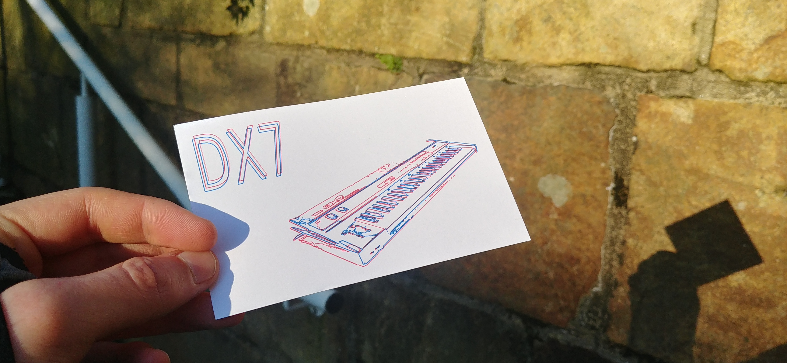
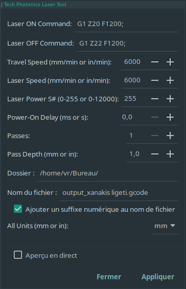
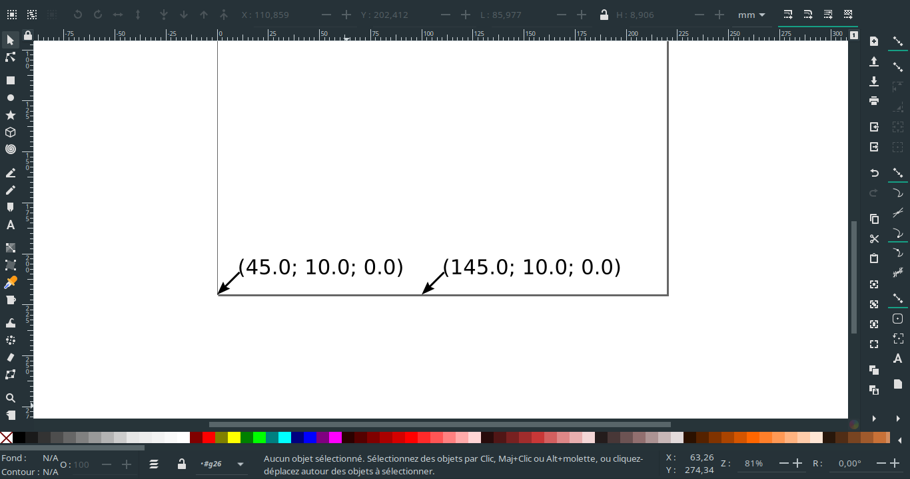
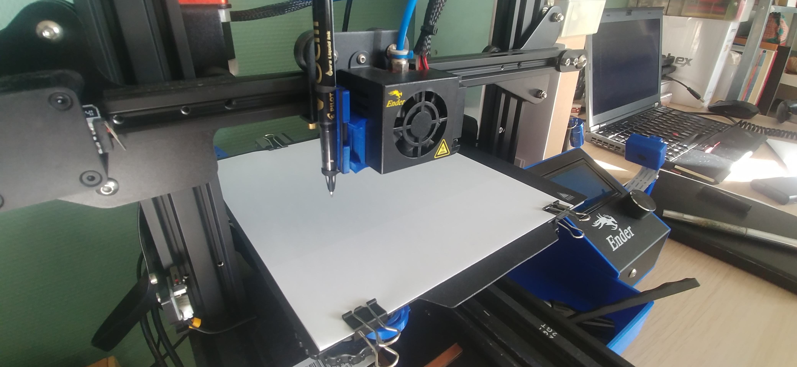

I've never been so fond of Christmas or New Year's cards sold in shops. Often expensive regarding their graphical quality, I prefer smaller editions with a less industrial graphical style. Unfortunately, these editions can be more expensive and the purchase of 20 cards for the whole family can represent a significant cost. In addition, they are difficult to personalize. 

This project aims to allow me to produce my own cards with my own graphic signature. These cards are therefore more personal and more customizable.

In order to produce high-resolution printed cards, I focused on 2D plotters. This technique enable a pen to draw shapes on a 2D surface. By using a pen to print, the quality is close to the quality of lithography or linography since the notion of pixel is absent from the process.



## Hardware Setup

To obtain a 2D plotter, I slightly modified my 3D printer (an Ender-3 Pro) by adding a pen holder on the side of the print head. The pen holder is not from me but from the *pascalmakes* designer. The plans are available [here][5]. Once printed, this holder allow you to attach a pen and change it in a short time, offering the possibility to print with several colours using several pens.

Regarding the choice of pens, after several tests, I noticed that it was preferable to use liquid ink pens such as the *Pilot Pure Liquid Ink*. The assembly is then as follows:


## Software Setup

The configuration of the software part is performed in the same way as in the video ["Teaching Tech"][1]. In this paragraph, I will summarise the content of this video, indicating my modifications. However, I advise you to have a look at it.

<iframe width="560" height="315" src="//www.youtube.com/embed/CuWZWAfBsm8" frameborder="0"></iframe>

The whole process will take place in the Inkscape software, which is free of charge and under GPL licence. It allows the user to manage vectorial drawings as well as to carry out editing work. 

To transform the vectorised drawing into gcode, it is necessary to install the extensions [jtechphotonics][3] and [KM-laser][4] as explained in the video.

Then, instead of the header and footer proposed in the video, use the ones shown below. These changes allow you to present the design at the end of the print and protect it from unintentional pen strokes.

```gcode
# HEADER
G28
G90
G0 Z30
M117 Deploy Pen NOW! 5
G4 P1000
M117 Deploy Pen NOW! 4
G4 P1000
M117 Deploy Pen NOW! 3
G4 P1000
M117 Deploy Pen NOW! 2
G4 P1000
M117 Deploy Pen NOW! 1
G4 P1000
M117 Drawing..
# FOOTER
G0 Z30;
G1 X0 Y220; present print
M18:
```

The geometry of the 3D printer leads to modify also the parameters of the Jtechphotonics extension as follows:



Again because of the geometry of the 3D printer and the pen support it is important to change the global offset.



## Production methods 

First, let's prepare the Inkscape workspace. Resize your page to the bed size of your 3D printer (**File > Document Settings**), in the case of an Ender-3 this is **220 x 220 millimetres**. 

Then draw the outline of your page. For example, if you want to print on a **82 x 128** size gift card, draw a rectangle of this size on your page to outline the printout.

Now, on the print bed of your 3D printer, pinch a sheet of paper with drawing clips as shown in the image below.



Export this outline in inkscape with the Jtechphotonics extension and print it (**export the gcode**). You have now delimited the area where you will place the card to be printed. Place it and glue it on the edge with **painter's tape**.

Place the vectored image in the rectangle, **delete the rectangle** and compute the gcode, then you can print your marvellous cards. Repeat the procedure with each layer and each colour for your print. 

That's it! You have your own **Christmas cards**.


[1]: <https://youtu.be/CuWZWAfBsm8> "2D printing on a 3D printer - Free and easy guide"
[2]: <https://inkscape.org/release/> "Inkscape website"
[3]: <https://jtechphotonics.com/?page_id=1980> "Jtechphotonics extention"
[4]: https://github.com/KnoxMakers/KM-Laser> "KM-Laser extention"
[5]: https://www.thingiverse.com/thing:3365530 "Pen holder for Creality Ender 3 (plotter mod)"
[6]: https://www.thingiverse.com/thing:3709721 "Ender 3 vinyl cutter mod"